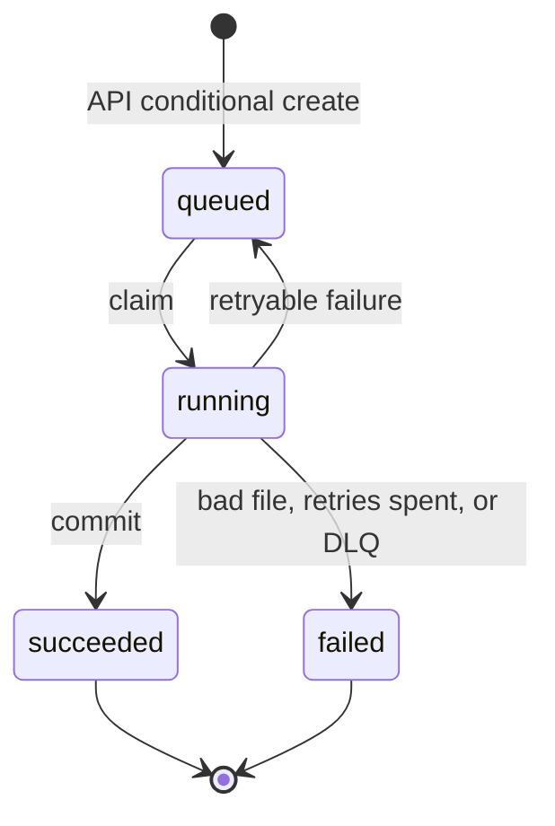

# Design Review

**Recommendation:** keep the proposal's shape (API Gateway + Lambda, DynamoDB, SQS, Fargate) and make six changes before v1. It fails on arithmetic before anything subtle: ten 2 GB conversions on a 4 GB task, under a 30-second timeout, for jobs that take minutes.

## 1. Risk ranking

**1. Duplicate or stale attempts can publish wrong results as successful** 
- Since there is no exclusive claim and every attempt writes the same `jobs/{id}/result` key unconditionally, two deliveries under 100ms apart both run and a stale one can overwrite a newer result.

**2. The current resource model can't run the workload** 
- Ten 2GB conversions share a 4GB task, a 30s timeout covers jobs taking minutes to tens of minutes, and scaling on long queue depth stops tasks whose exports are still running
- "Converter sometimes exits with code 137 and succeeds on a later run" is the out of memory killer, and can take out every job on that task.

**3. Some jobs will never reach a terminal state** 
- A dying worker never runs its `catch`, and a message exhausting its SQS receives reaches the DLQ with the job still in `running` state. Callers will poll forever.

 

**Deliberately Left Alone:**

- **Fargate, scaling from zero.** Compute is a very low cost in the bill, and a 1-2 minute cold start hardly matters compared to a half-hour export. Can revisit this if imports wait more than 5 minutes to start or if compute grows past 25% of the bill.
- **Webhooks best-effort, polling as the contract.** Callers are internal services that can poll. Can revisit if above 0.5% of completions exhaust their webhook retries (or if a consumer can't poll)

## 2. Smallest changes before releasing v1

1. **One conversion per task.** (1 vCPU / 4 GB, concurrency only 1). Single-threaded work needs 2 GB, so an out of memory failures costs one job, not ten.
2. **Two queues with DLQs, two ECS services, one image.** The same image runs in both services with different settings: imports time out at 20 minutes and exports at 90, each queue's visibility timeout must be at least its attempt timeout plus grace period. Each service has its own task ceiling, and export tasks get 120 GiB of ephemeral storage.
3. **Kill and reap on timeout.** When an attempt runs out of time, the worker kills the process and waits for it to exit before releasing the job. Exit code 2 means the input file is bad, so that job fails immediately instead of retrying.
4. **Scaling that cannot kill live work.** Scale on visible and in-flight messages together rather than visible alone, and have workers hold ECS scale-in protection while they convert, so neither a scale-in nor a deploy can kill an export that is still running.
5. **Every job reaches a terminal state the caller can see.** The DLQ's `maxReceiveCount` is 6, above the attempt budget of 3, so a job fails on its own terms before the message is dead-lettered. A small Lambda on the DLQ marks anything that still slips through as failed, and webhooks fire from a DynamoDB Stream whenever a job reaches a terminal state, so a crash between the commit and the send cannot lose one.
6. **Conditional claim, lease, and fencing.** Covered in part 2. Each attempt writes to its own prefix, `jobs/{id}/attempts/{n}/…`, and a result is only published when a conditional write of `outputKey` succeeds. That write is the commit point, and an attempt that no longer owns the job cannot make it.

## 3. Job lifecycle

**Ownership.** DynamoDB holds the truth about every job, and SQS only let's us know about the queue of work ahead. Whichever worker holds the lease owns that job until the lease runs out, and once it has claimed the job, every write it makes is conditional on the job still being `running` and the attempt still being its own.

**Import.**

- **Submit.** The caller POSTs the job type, an S3 input key, and an idempotency key. The Lambda records the job as `queued` and puts a message on the queue. The same key always returns the same job, so a duplicate request, or a crash between those two writes, is harmless.
- **Claim.** A worker node moves the job to `running` as attempt 1 and takes a lease of 20 minutes plus grace.
- **Run.** It runs the TypeScript converter in a child process — a library call inside the worker could not be killed when it timed out — writing its output to `attempts/1/result.json`.
- **Commit.** A conditional write turns `running` attempt 1 into `succeeded` and records the `outputKey`. Only then does the worker delete the message.
- **Retries.** Whole attempts, through SQS redelivery with backoff, up to three. Nothing retries inside the converter, and exit code 2 fails the job at once.
- **Outcome.** The caller reads `GET /jobs/{id}`, the source of truth, or takes the webhook the stream fires.

**Export.** The same state machine on its own queue. Only these steps differ:

- **Claim.** The lease and the timeout are both 90 minutes instead of 20.
- **Run.** The vendor JVM runs as a subprocess, so killing it has to target the whole process group.
- **Commit.** The zip goes to `attempts/{n}/package.zip` in parts, and that upload happens inside the attempt's timeout, so the commit comes only after the upload has finished.
- **Cleanup.** A killed attempt leaves an unfinished upload behind, which the lifecycle rule clears up.

## 4. Operations, deployment, observability

| Signal | Metric | Emitted by | Threshold | Action |
|---|---|---|---|---|
| **Backlog age** | `ApproximateAgeOfOldestMessage`, per queue | AWS/SQS, natively | Import > 60 min, Export > 4 h | At max tasks, raise max within the vCPU quota. If tasks crash-loop, roll back |
| **Attempt outcomes** | `AttemptOutcome`, with dimensions queue, outcome, release | The worker poll loop, from `handle()`'s return value, as CloudWatch EMF logs | `retry_scheduled` + `failed_exhausted` > 5% of attempts over 30 min; any sustained `superseded` | Compare memory utilization against outcomes by release — that separates sizing from a bad release, which gets rolled back. `superseded` means the lease is too short or clocks are wrong.  |
| **Stuck jobs** | `ApproximateNumberOfMessagesVisible`, on the DLQ | AWS/SQS, natively | > 0 for 5 min | The DLQ Lambda has already failed the job, so no caller hangs; on-call finds the cause and redrives |

**Deployment.** The worker, the API Lambda, and the CDK app all live in one repo. The infrastructure is split into a stateful stack (table, bucket, queues) that rarely changes, and a stateless stack (services, alarms) that changes often. Every merge to main goes through GitHub Actions: run tests and `cdk diff`, build an image tagged with the git SHA, deploy to staging, run a smoke suite against the real API, then promote to prod. Prod rolls out behind the ECS circuit breaker, which watches the attempt-failure-rate and DLQ-depth alarms and rolls back automatically; the `release` dimension shows whether new tasks are failing more than old ones. If a release turns out bad, redeploy the previous image. To pause work without losing it, set desired count to zero — jobs just wait in the queue, since a job's true state lives in its database record, not in whatever task is running it.

## 5. Sizing and cost

Averages are 3 min/100 MB per import and 30 min/25 GB per export (NOTES.md). A big assumption is that results are kept 90 days just like the metadata. Prices are us-east-1 on-demand x86: 1 vCPU / 4 GB ≈ $0.0405 + 4 × $0.00445 ≈ **$0.058/task-hour**.

**Onboarding evening (3,000 jobs):**

| | Jobs × duration | Task-hours | Max tasks | Drains in |
|---|---|---|---|---|
| Imports | 2,400 × 3 min | 120 | 150 | ~50 min |
| Exports | 600 × 30 min | 300 | 100 | ~3 h |
| **Total** | | **420** | **250** | |

Peak is 250 tasks, so 250 vCPU. The evening costs 420 × $0.058 ≈ **$25**

**Monthly at normal volume** (800 imports, 200 exports per day):

| Line item | Volume | Rate | $/month |
|---|---|---|---|
| **S3: export packages** | 200/day × 25 GB × 90 d = 450 TB | $0.023/GB to 50 TB, $0.022 after | **9,950** |
| S3: import JSON | 800/day × 0.1 GB × 90 d = 7.2 TB | $0.022/GB | 160 |
| Fargate compute | 800 × 3 min + 200 × 30 min = 140 task-h/day | $0.058/task-h × 30 d | 245 |
| Export ephemeral storage | 100 task-h/day × 30 d × 100 GB = 300,000 GB-h | $0.000111/GB-h | 35 |
| CloudWatch, DynamoDB, SQS, API GW, Lambda | small at 1,000 jobs/day, even with polling | — | 150 |
| **Total** | | | **~10,500** |

**Export package storage is ~95% of the bill.** The single biggest cut is a lifecycle rule expiring packages after 7 days: 200 × 25 GB × 7 d = 35 TB × $0.023 ≈ **$800**, taking the total to **~$1.4k/month**
